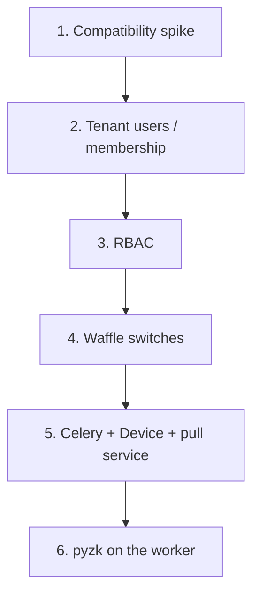

# Pattika backend roadmap

Keep the current visual system and Django backend. Sequence identity first, then access control and flags, then devices. Do **not** mix this work with the Datastar frontend rewrite — both touch `templates/base.html`, navigation, and views.

**Out of scope here:** CSS/layout redesign, Datastar Pro, switching the web process to ASGI, changing attendance calculation rules, services/selectors/models except where this plan names them.



---

## Current state

| Area | State |
|------|--------|
| Tenancy | `django-tenants` only. Users live in the **public** schema (`django.contrib.auth` in `SHARED_APPS`). No membership check — a user created on tenant A can log in on tenant B’s domain. |
| Employees | Tenant-schema `Employee` with optional `OneToOne` to `User`. `employee_create` always creates a public User + invite link. Punch-only staff still get login accounts. |
| RBAC | `Role` / `Permission` models exist (unapplied `employees/migrations/0003_permission_role_employee_role.py`). `Employee.role` is set. Views are `login_required` only. Sidebar and command palette show everything. |
| Attendance | Provider-agnostic `AttendanceTransaction` (`external_id`, `external_employee_id`, `raw_data`, `source=biometric`). Ingest service: `attendance_transaction_create`. No `Device` model, no unique punch key. |
| Flags | None. |
| Jobs | No Celery. WSGI only (`config/wsgi.py`). |
| `emp_code` | Indexed, **not unique**. |

---

## Priority order

1. Compatibility spike (`django-tenant-users`, waffle, Celery/Redis on Django 6.1 + Python 3.14)
2. Tenant identity / membership
3. RBAC enforcement
4. Waffle (per-tenant module switches)
5. Celery worker + beat + `Device` + pull service
6. Real pyzk (only if the worker can reach the clocks)

Datastar stays a **separate track** after identity is stable, or after this sequence.

---

## 1. Compatibility spike (1–2 days)

Do this before writing migrations.

### django-tenant-users

The package wants:

- Custom `AUTH_USER_MODEL` inheriting `UserProfile` (email is the username)
- `Company` inheriting `TenantBase` instead of `TenantMixin`
- `tenant_users.permissions` in **both** `SHARED_APPS` and `TENANT_APPS`
- `TenantAccessMiddleware` so non-members get 404 on another company’s domain
- `provision_tenant()` / `tenant.add_user()` instead of raw `create_tenant`

Go/no-go: if it installs and `provision_tenant` + `add_user` work on a throwaway branch, use it. If not, implement a thin `TenantMembership` (`user`, `company`, `is_owner`, `role`) in the public schema plus middleware. That is most of the value without fighting the package.

### waffle

Confirm Django 6.1 install. Prefer **Switches** in `TENANT_APPS` (per-company on/off). If it fights the stack, a `Company.features` JSONField is enough.

### Celery

Confirm Redis locally and `celery -A config worker` starts against this project.

### Devices / network (blocks pyzk, not Celery scaffold)

ZKTeco talk is TCP **4370** on the LAN. A cloud WSGI/Celery process generally cannot reach `192.168.x.x`.

| Option | When |
|--------|------|
| **A. App on-prem** (same network as devices) | Simplest: Celery worker + pyzk. |
| **B. On-site collector** | Cloud SaaS. Agent pulls the device and POSTs punches. |
| **C. ADMS / BioTime push** | Newer firmware; `pyzk` often does **not** work. |

Confirm exact clock models. `pyzk` is unofficial and already failing on some ADMS-default machines.

---

## 2. Tenant users (highest risk)

**Goal:** “this user belongs to this company” is a real rule. Creating an employee no longer dumps a global User with access to every tenant.

Do **not** make `Employee` the user model. Users are public/global; employees are tenant data.

| | User (public) | Employee (tenant) |
|--|--|--|
| Who | Login identity (email) | HR / punch record |
| Always exists? | Only people who log in | Every person who can punch |
| Multi-company | Same email, many memberships | One row per company schema |

Keep `Employee.user` nullable. Factory workers punch; they should not get accounts.

Concrete work:

1. Custom user model **now**. Stock `auth.User` is still in use; changing `AUTH_USER_MODEL` later is painful.
2. Switch allauth to **email login**. Today `ACCOUNT_LOGIN_METHODS = {"username"}`.
3. Change `employee_create`:
   - create/get user by email
   - `tenant.add_user(user)` (or create `TenantMembership`)
   - create `Employee` linked to that user **only if they should log in**
4. Middleware: authenticated request on a tenant domain without membership → deny.
5. Update `common/tests/base.py`: tests create a public user and log in with no membership. That must start failing until membership is granted.

**Do not** fold RBAC into this PR. Membership first; roles second.

Do **not** put `auth` in `TENANT_APPS` (separate user tables per company). That is the opposite of django-tenant-users. Pick one.

---

## 3. RBAC

The custom `Role` / `Permission` in the **tenant** schema is the right place. Django’s `auth.Permission` lives in the public schema and is a poor fit for per-company roles. `django-tenant-users`’ `UserTenantPermissions` can sit beside this for “is this user allowed in this schema”; keep **domain** perms on your `Permission` model.

Adjust the started models:

- Put `role` on **membership / user-in-tenant**, not only on `Employee`. Company owner and a future device operator may not be employees.
- Seed system roles (`is_system=True`): Owner, HR Admin, Manager, Employee (self), maybe Device Operator.
- Codename catalog, e.g. `employees.view`, `employees.invite`, `attendance.view`, `attendance.correct`, `leave.approve`, `reports.view`, `devices.manage`.

Enforcement (HackSoft-style):

- Helper: `user_has_perm(user, "leave.approve")`.
- View decorator / mixin on every list/add.
- **Selectors** do row-level scope (`branch`, `department`) — that is not a permission codename.
- Filter `command_palette_for` and sidebar by permission. Hiding a link is not security; views must still check.

Ship in two slices:

1. **Module perms** — can you open Employees / Leave / Reports at all.
2. **Action + scope** — approve leave, export, “only my department”.

Keep unapplied `0003`, but add a data migration that seeds permissions/roles.

---

## 4. Waffle (per-tenant module switches)

Use it as **per-tenant module switches**, not per-user A/B.

Put `waffle` in `TENANT_APPS` so each company has its own `Switch` rows. Then `` / `@switch_is_active("leave")` is tenant-scoped.

Suggested switches:

- `leave`, `schedule`, `reports`, `overtime`
- `devices` — **off until pyzk is ready**

Caveats:

- Waffle cache keys must be tenant-prefixed or flags leak across schemas.
- Prefer **Switches** (on/off). Flags (percentage, groups) are extra complexity you do not need yet.
- Gate **nav + URLs + Celery tasks**. A hidden sidebar link with a live poller is not “off”.

---

## 5. Celery + periodic device pull

Celery is a **second process** next to WSGI. Beat fires on a timer; the worker must set the tenant schema itself because there is no HTTP middleware on background jobs.

Attendance ingest already exists (`attendance_transaction_create`). Add: broker + worker + beat, a **thin** task layer, and a pull **service**. A `Device` model is required before the pull does anything real.

Keep WSGI. Run three processes in dev: `runserver`, `celery worker`, `celery beat`.

### Layout

```text
config/celery.py          # app instance
config/__init__.py        # import celery so Django loads it
config/settings.py        # broker + beat schedule
attendance/tasks.py       # thin wrappers
attendance/services.py    # device_attendance_pull (real work)
```

**Broker:** Redis. Add `celery[redis]` (and `redis` if needed) to `pyproject.toml`. `.env`:

```env
CELERY_BROKER_URL=redis://localhost:6379/0
CELERY_RESULT_BACKEND=redis://localhost:6379/0
```

### Celery app

`config/celery.py`:

```python
import os
from celery import Celery

os.environ.setdefault("DJANGO_SETTINGS_MODULE", "config.settings")

app = Celery("pattika")
app.config_from_object("django.conf:settings", namespace="CELERY")
app.autodiscover_tasks()
```

`config/__init__.py`:

```python
from config.celery import app as celery_app

__all__ = ("celery_app",)
```

Settings:

```python
CELERY_BROKER_URL = os.getenv("CELERY_BROKER_URL", "redis://localhost:6379/0")
CELERY_RESULT_BACKEND = os.getenv("CELERY_RESULT_BACKEND", CELERY_BROKER_URL)
CELERY_TIMEZONE = TIME_ZONE
CELERY_TASK_TRACK_STARTED = True
CELERY_TASK_TIME_LIMIT = 5 * 60
CELERY_BEAT_SCHEDULE = {
    "device-sync-all-tenants": {
        "task": "attendance.tasks.device_sync_all_tenants",
        "schedule": 60.0 * 5,  # every 5 minutes
    },
}
```

Skip `django-celery-beat` for v1. One static schedule in settings is enough. If you add it later, put it in **`SHARED_APPS`** so periodic-task rows live in the public schema.

### Tasks stay thin (HackSoft)

django-tenants does **not** set `search_path` for Celery. Pass `schema_name` as a task argument and wrap work in `schema_context`. Never rely on leftover connection state from the previous task.

Fan-out so one slow clock does not block the others:

```python
# attendance/tasks.py
from celery import shared_task
from django_tenants.utils import get_public_schema_name, schema_context


@shared_task
def device_sync_all_tenants():
    from companies.models import Company

    for company in Company.objects.exclude(schema_name=get_public_schema_name()):
        device_sync_tenant.delay(company.schema_name)


@shared_task
def device_sync_tenant(schema_name: str):
    from attendance.models import Device

    with schema_context(schema_name):
        device_ids = list(
            Device.objects.filter(is_active=True).values_list("id", flat=True)
        )

    for device_id in device_ids:
        device_sync_one.delay(schema_name, device_id)


@shared_task(
    bind=True,
    autoretry_for=(ConnectionError, TimeoutError),
    retry_backoff=True,
    retry_kwargs={"max_retries": 3},
)
def device_sync_one(self, schema_name: str, device_id: int):
    from attendance.models import Device
    from attendance.services import device_attendance_pull

    with schema_context(schema_name):
        device = Device.objects.get(id=device_id)
        device_attendance_pull(device=device)
```

Rules:

- Import services **inside** the task body.
- Import the task with a `_task` suffix at module level if dispatching from a service; use `transaction.on_commit` for request-triggered sync.
- Retry network failures only. Do not retry duplicate-punch integrity errors.
- Do not call `pyzk` from the task. The task fetches ids, then calls a service.
- If waffle `devices` is off for that tenant, `device_sync_tenant` should no-op.

### Device model + ingest

Tenant-schema `Device`: name, IP, port, comm key, branch, `is_active`, `last_synced_at`, `last_error`.

Also:

- Unique `emp_code` per tenant.
- Optional `Employee.device_user_id` if the clock PIN ≠ emp_code.
- Unique constraint on punch `external_id` (or `(source, external_id)`).

Pull service:

1. Connect via pyzk (or a fake in tests).
2. Map device `user_id` → `Employee`.
3. Insert via existing `attendance_transaction_create`.
4. Stable `external_id`, e.g. `f"zk:{device.id}:{user_id}:{timestamp.isoformat()}"`. Catch duplicates and skip.
5. Update `device.last_synced_at` / `last_error`.
6. **Not** `clear_attendance()` on the device until a full successful persist.
7. **Not** calculate `DailyAttendance` in the same job (second beat task later).

```python
def device_attendance_pull(*, device) -> int:
    logs = zk_fetch_attendance(device=device)  # adapter, mockable
    created = 0
    for log in logs:
        employee = employee_for_device_user(user_id=log.user_id)
        if employee is None:
            continue  # record unmatched ids on the device row
        try:
            attendance_transaction_create(
                employee=employee,
                external_id=f"zk:{device.id}:{log.user_id}:{log.timestamp.isoformat()}",
                timestamp=log.timestamp,
                direction="unknown",
                source="biometric",
                external_employee_id=str(log.user_id),
                raw_data={...},
            )
            created += 1
        except IntegrityError:
            continue
    return created
```

### Multi-tenant Celery pitfalls

| Pitfall | What to do |
|---------|------------|
| Worker has no tenant | Always `schema_context(schema_name)` |
| Schema leak between tasks | Pass `schema_name` in every `.delay()`; never a global “current tenant” |
| Overlapping 5‑min runs | Lock per device (`cache.lock(f"device-sync:{schema}:{id}")`) or `expires` on the task |
| `django-celery-beat` in tenant apps | Periodic tables would be per schema; keep beat config in settings or public schema |
| Tests hitting Redis | `CELERY_TASK_ALWAYS_EAGER = True` in test settings |

### Local run

```bash
# terminal 1
uv run manage.py runserver

# terminal 2
uv run celery -A config worker -l info

# terminal 3
uv run celery -A config beat -l info
```

One-off: `uv run celery -A config call attendance.tasks.device_sync_all_tenants`.

### Celery / devices build order

1. Redis + `config/celery.py` + worker starts (hello-world task is enough).
2. `Device` model + unique `emp_code` + unique punch `external_id`.
3. `device_attendance_pull` with a mocked ZK client in tests.
4. The three tasks + beat every 5 minutes, gated by waffle `devices`.
5. Wire real pyzk — only if the worker can reach the clocks (LAN / VPN).

Celery does not replace the network constraint. If the app is SaaS, the worker has to run on-prem (or you need a collector that pushes punches in).

---

## 6. pyzk

Unofficial library (`from zk import ZK`). Typical flow: connect → `disable_device` → `get_attendance` → persist → `enable_device` → disconnect.

Keep an adapter (`zk_fetch_attendance`) so tests mock the client, not Celery.

Do not calculate daily attendance inside the pull. Ingest raw punches first.

---

## What to pause

- **Datastar rewrite** — same files as RBAC nav and waffle-gated chrome. Sequence: identity → RBAC/waffle → either Datastar or devices, not both at once.
- **Employee self-service portal** — needs RBAC “Employee” role first.
- **Approve/reject UI** — natural follow-on once `leave.approve` exists.
- **Putting `auth` in `TENANT_APPS`** — opposite of django-tenant-users.

---

## Near-term backlog

**Now (this week)**

1. Compatibility spike: `django-tenant-users` + waffle + Celery/Redis on Django 6.1.
2. Device/network decision: on-prem pyzk vs collector vs ADMS.
3. Confirm clock models.

**Next (identity PR)**

Custom user, `TenantBase` / membership, middleware, `employee_create` + tests. No roles yet.

**Then (RBAC PR)**

Seed permissions, decorator, selector scoping, filter sidebar/palette. Apply/fix `0003`.

**Then (waffle PR)**

Tenant Switches, wrap Leave/Schedule/Reports/Devices.

**Then (Celery + devices PR)**

Redis, `config/celery.py`, `Device`, unique `emp_code` / punch `external_id`, pull service (mocked ZK), three tasks + beat every 5 minutes, gated by `devices`. Then real pyzk if the worker is on the LAN.

---

## Related

| Document | Use when |
|----------|----------|
| [frontend-features.md](frontend-features.md) | Current UI behaviour, auth gaps |
| [ui-shell-plan.md](ui-shell-plan.md) | Role-aware nav (phase 4) |
| Datastar rewrite plan | Frontend interactivity swap — separate track |
