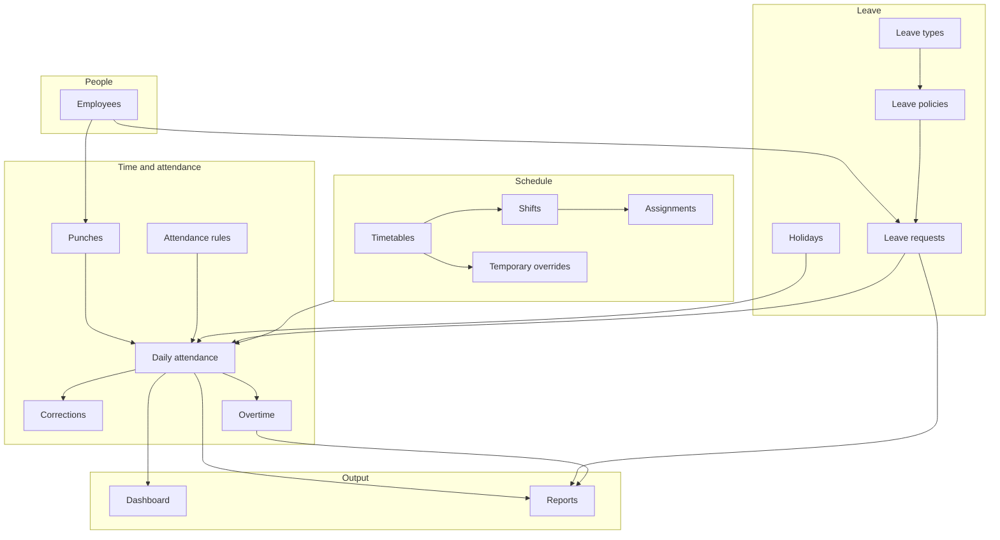

# ITTISAL HRMS — Product & Features Overview

Reference for **what the app does** and **how users move through it**. For CSS classes, form fields, table columns, and DataTables config, see [frontend-handoff.md](frontend-handoff.md).

**App name (UI):** ITTISAL HRMS  
**Repo / project:** Pattika  
**Audience:** HR admins and internal staff managing attendance, leave, and schedules  
**Delivery:** Django server-rendered HTML — no separate SPA or public REST API for the UI

---

## What this app is

ITTISAL HRMS is a **multi-tenant HR and attendance system**. Each company (tenant) has its own isolated data: employees, punch records, daily attendance, leave, work schedules, and reports.

A typical day for an HR user:

1. Open the **dashboard** — see who is present, absent, late, or on leave today
2. Review **pending** leave requests, overtime, and attendance corrections
3. Browse or add **employees**, **punches**, and **leave requests**
4. Configure **schedules** (timetables, shifts, assignments)
5. Run **reports** and export CSV / Excel / PDF

---

## Navigation structure

The sidebar (`templates/partials/sidebar.html`) is the primary IA. Sections:

| Section | Purpose | Collapsible |
|---------|---------|-------------|
| **Overview** | Dashboard home | No |
| **Employees** | Directory + add employee | No |
| **Attendance** | Punches, daily records, corrections, rules | No |
| **Leave** | Types, policies, requests, holidays | Yes |
| **Schedule** | Timetables, shifts, assignments, temporary | Yes |
| **Reports** | Hub + 7 report types | Yes |
| **Footer** | Profile, log out | — |

List pages show a primary **Add …** action in the top header (not only in the sidebar). Breadcrumbs reflect the current path (see `config/navigation.py`).

---

## Feature areas

### Dashboard (`/`)

Operational home page for “right now.”

| Element | What it shows |
|---------|----------------|
| KPI cards | Active employees; present / absent / late / on leave / incomplete / missing punch **today**; present % |
| Alert KPIs | Pending leave, pending overtime, pending corrections (highlighted styling) |
| Chart | Doughnut chart — today’s attendance breakdown (Chart.js; refreshes via HTMX every 60s + manual Refresh) |
| Quick actions | Links to leave requests, corrections, exceptions report, overtime report |

**Not on dashboard:** editable tables, approval buttons, or historical trends (future work).

---

### Employees

**Purpose:** Company directory — who works here, where they sit in the org, and how they log in.

| Page | URL | User action |
|------|-----|-------------|
| Employee list | `/employees/` | Search and browse staff |
| Add employee | `/employees/add/` | Create employee + linked login user |

**Add-employee flow (important for UI):**

1. HR fills form (name, code, department, position, contact, hire date, active flag)
2. Backend creates a Django user with a **temporary unusable password**
3. Success UI shows an **invite box** — password-setup link to copy and send to the employee
4. Employee list refreshes via HTMX (`employeeCreated` event)

Employees can optionally link 1:1 to a login user. Inactive employees remain in the system but are excluded from “active” counts.

---

### Attendance

Four related areas — raw events → calculated days → fixes → configuration.

#### Punches (`/attendance/transactions/`)

Raw check-in/check-out events (from biometric devices, web, mobile, manual entry, or import).

| Field concept | Values |
|---------------|--------|
| Direction | Check in, check out, unknown |
| Source | Biometric, web, mobile, manual, import |
| Identity | Employee, timestamp, external IDs |

Users can **record a punch** manually when needed.

#### Daily attendance (`/attendance/daily/`)

One row per employee per day — the **calculated** attendance outcome after rules and schedule are applied.

| Status (badges in UI) | Meaning |
|-----------------------|---------|
| Present | Attended as expected |
| Absent | Did not attend |
| Late | Arrived late |
| Early out | Left early |
| Incomplete | Missing check-in or check-out |
| Day off / Holiday | Non-working day |
| Leave | On approved leave |
| Worked holiday / Overtime | Special cases |

Columns include scheduled minutes, worked minutes, late minutes, overtime minutes, and check-in/out flags.

#### Corrections (`/attendance/corrections/`)

When daily attendance is wrong, staff submit a **correction request** (adjust check-in/out, reason, status). New submissions default to **pending**. Dashboard counts pending corrections.

#### Rules (`/attendance/rules/`)

Business rules for attendance calculation — grace periods, whether missing punch counts as absence or incomplete, duplicate punch window, multiple in/out allowed, etc. Admin configuration, not day-to-day data entry.

#### Overtime (data only in lists/reports)

Overtime records exist with statuses: pending, approved, rejected, auto approved. Visible on dashboard (pending count) and in the overtime **report** — there is no dedicated overtime list page in the sidebar today.

---

### Leave

#### Configuration

| Page | Purpose |
|------|---------|
| **Types** | Categories of leave (paid?, requires approval?, half-day?, negative balance?) |
| **Policies** | Entitlement and accrual rules per type (yearly/monthly, carry-forward, expiry) |
| **Holidays** | Company calendar (single day or date range; public / company / optional) |

#### Requests (`/leave/requests/`)

Employees (selected by HR on the form) request time off.

| Status | Typical meaning |
|--------|-----------------|
| Draft | Not submitted |
| Pending | Awaiting decision |
| Approved / Rejected / Cancelled | Final states |

Form captures leave type, date range, days, duration type (full/half/hourly), half-day flags, reason.

**UI gap today:** lists and create forms exist; **no approve/reject buttons** in the app UI (workflow status exists in data only).

---

### Schedule

Defines **when** people are expected to work.

| Concept | Purpose |
|---------|---------|
| **Timetable** | Check-in/out times, flexible work minutes, grace settings, work type (work / day off / overtime) |
| **Shift** | Named rotation — cycle of timetables over days/weeks/months (inline **formset table** on add form for cycle days) |
| **Assignment** | Apply a shift to an employee, department, or group for a date range |
| **Temporary schedule** | One-off override for one employee on one date |

Schedule data feeds daily attendance calculation on the backend. Frontend shows configuration lists and add forms.

---

### Reports (`/reports/`)

Filtered analytics with **export** (CSV, Excel, PDF via `?format=` query param).

| Report | Question it answers |
|--------|---------------------|
| **Attendance summary** | Per employee: totals for present, absent, late, leave, minutes |
| **Individual attendance** | Day-by-day detail for one selected employee |
| **Department attendance** | Aggregated by department |
| **Exceptions** | Late, absent, incomplete, missing punch — filterable by exception type |
| **Punch log** | Raw punch stream in a date range |
| **Overtime** | Overtime minutes and approval status |
| **Leave** | Balance, utilization, or pending leave (report type toggle) |

**Report UX pattern:**

1. Filter panel (date range, department, employee, report-specific fields)
2. **Apply filters** → full page reload with results
3. Paginated result table (25 rows per page)
4. Export links preserve filter params

Reports hub is a simple link list — not a data table.

---

## Page types (how screens behave)

Understanding page **type** helps you know which interaction patterns apply.

| Type | Count | Pattern | HTMX | DataTables |
|------|-------|---------|------|------------|
| Dashboard | 1 | KPIs + chart + links | Chart panel refresh | No |
| List | 13 | Search + table + pagination | Search + post-add refresh | Planned (21 tables total incl. reports) |
| Add form | 13 | Form partial in container | POST → swap form, fire event | No |
| Report | 7 | Filters + table + export | No (GET reload) | Planned on result tables |
| Report hub | 1 | Link cards | No | No |
| Profile | 1 | Read-only details | No | No |
| Login | 1 | Standalone centered form | No | No |

**List pages** fire custom body events after a successful add (e.g. `employeeCreated`, `leaveRequestCreated`) so the list partial reloads without a full page navigation.

**Add employee** is the only add flow with a special success state (invite link), not just `.message.success`.

---

## Auth and access

| Topic | Current behavior |
|-------|------------------|
| Login | Username + password via django-allauth (`/accounts/login/`) |
| After login | Redirect to dashboard (`/`) |
| Profile | Read-only username and email (`/accounts/profile/`) |
| Protection | All app pages require login |
| Roles | **Not implemented** — every logged-in user sees the full sidebar |
| Approvals | **Not implemented in UI** — pending statuses exist in data |

There is no employee self-service portal in this UI; HR staff use the admin-style app. Django admin (`/admin/`) exists separately for superusers.

---

## Multi-tenant context (UI impact)

Each company is a **tenant** with its own database schema, resolved by **domain/hostname**.

| For frontend | Implication |
|--------------|-------------|
| Tenant picker | **Not needed** — one company per URL |
| Company name in chrome | **Not shown** — brand is “ITTISAL HRMS” |
| Data scoping | Automatic — all lists/reports are already tenant-scoped |
| Settings UI | **Not built** — no company profile page yet |

---

## Status badges and visual language

Many tables show **status as colored badges** (`.badge.status-*`), not plain text. Common groups:

**Employee:** active / inactive  
**Leave request:** draft, pending, approved, rejected, cancelled  
**Daily attendance:** present, absent, late, incomplete, leave, …  
**Correction / overtime:** pending, approved, rejected, …

Some status values appear in data but **lack dedicated badge CSS yet** (e.g. `early_out`, `auto_approved`). When styling, cover all values listed in [frontend-handoff.md](frontend-handoff.md).

Dashboard **alert KPIs** use `.kpi-card-alert` for pending counts that need attention.

---

## What is built vs not built

Use this to avoid assuming features that do not exist yet.

### Built today

- Full sidebar app shell with breadcrumbs and mobile drawer
- Dashboard with KPIs, chart, quick actions
- 13 list + 13 add flows across employees, attendance, leave, schedule
- 7 filtered reports with export
- HTMX live search and list refresh on add
- Employee invite link on successful add

### Not built (backend or UI gaps)

- Edit or delete from list pages (create + list only)
- Approve / reject for leave, corrections, overtime in the app UI
- Role-based navigation or field permissions
- Sidebar badge counts for pending items
- Employee self-service (submit own leave, view own attendance)
- Company / tenant settings page
- Server-side DataTables JSON APIs (client-side DT planned first)
- Historical trend charts on dashboard (only today’s doughnut chart)

---

## Related docs

| Document | Use when you need… |
|----------|-------------------|
| [frontend-handoff.md](frontend-handoff.md) | CSS classes, every form field, every table column, DataTables init, layout hooks |
| [ui-shell-plan.md](ui-shell-plan.md) | Shell migration history and planned nav polish |

---

## Quick site map

| Section | List | Add |
|---------|------|-----|
| Dashboard | `/` | — |
| Employees | `/employees/` | `/employees/add/` |
| Punches | `/attendance/transactions/` | `/attendance/transactions/add/` |
| Daily attendance | `/attendance/daily/` | `/attendance/daily/add/` |
| Corrections | `/attendance/corrections/` | `/attendance/corrections/add/` |
| Rules | `/attendance/rules/` | `/attendance/rules/add/` |
| Leave types | `/leave/types/` | `/leave/types/add/` |
| Leave policies | `/leave/policies/` | `/leave/policies/add/` |
| Leave requests | `/leave/requests/` | `/leave/requests/add/` |
| Holidays | `/leave/holidays/` | `/leave/holidays/add/` |
| Timetables | `/schedule/timetables/` | `/schedule/timetables/add/` |
| Shifts | `/schedule/shifts/` | `/schedule/shifts/add/` |
| Assignments | `/schedule/assignments/` | `/schedule/assignments/add/` |
| Temporary | `/schedule/temporary/` | `/schedule/temporary/add/` |
| Reports hub | `/reports/` | — |
| Attendance summary | `/reports/attendance/` | — |
| Individual attendance | `/reports/individual/` | — |
| Department attendance | `/reports/department/` | — |
| Exceptions | `/reports/exceptions/` | — |
| Punch log | `/reports/punch-log/` | — |
| Overtime | `/reports/overtime/` | — |
| Leave reports | `/reports/leave/` | — |
| Profile | `/accounts/profile/` | — |
| Login | `/accounts/login/` | — |

---

*Update this doc when adding user-facing features, workflows, or new sections to the app.*
