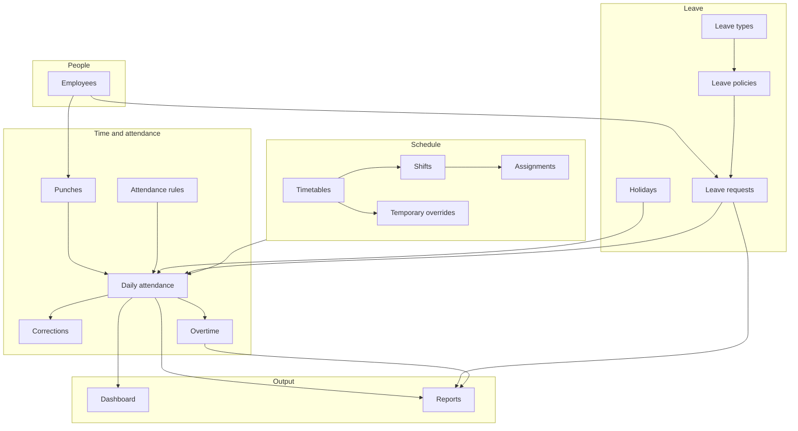

# ITTISAL HRMS — Product & Features Overview

Reference for **what the app does** and **how users move through it**. For CSS classes, form fields, table columns, and DataTables config, see [frontend-handoff.md](frontend-handoff.md). For SPA behavior, see [alpine-spa.md](alpine-spa.md).

**App name (UI):** ITTISAL HRMS  
**Python package:** `pattika`  
**Audience:** HR admins and internal staff managing attendance, leave, and schedules  
**Delivery:** Django server-rendered HTML — HTMX + Alpine shell (not a separate SPA or public REST UI)

**Brand:** primary `#8A1538` · wordmark + favicon in `static/brand/`

---

## What this app is

ITTISAL HRMS is a **multi-tenant HR and attendance system**. Each company (tenant) has its own isolated data: employees, punch records, daily attendance, leave, work schedules, and reports.

A typical day for an HR user:

1. Open the **dashboard** — see who is present, absent, late, or on leave today
2. Review **pending** leave requests, overtime, and attendance corrections
3. Browse or add **employees**, **punches**, and **leave requests**
4. Configure **schedules** (timetables, shifts, assignments)
5. Run **reports** and export CSV / Excel / PDF

---

## Navigation structure

The sidebar (`templates/partials/sidebar.html`) is the primary IA. Quick actions + command palette (⌘K) mirror the same destinations.

| Section | Purpose |
|---------|---------|
| **Dashboard** | Home KPIs + chart |
| **Employees** | Directory, departments, positions, roles, permissions |
| **Attendance** | Punches, daily, corrections, rules |
| **Leave** | Types, policies, requests, holidays |
| **Schedule** | Timetables, shifts, assignments, temporary |
| **Reports** | Hub + report types |
| **Chrome** | Profile menu, theme customizer, notifications |

List pages show a primary **Add …** action in the page head (often opens the **right drawer**). Breadcrumbs come from `config/navigation.py`.

---

## Feature areas

### Dashboard (`/`)

Operational home page for “right now.”

| Element | What it shows |
|---------|----------------|
| KPI cards | Active employees; present / absent / late / on leave / incomplete / missing punch **today**; present % |
| Alert KPIs | Pending leave, pending overtime, pending corrections |
| Chart | Doughnut — today’s attendance (Chart.js; HTMX refresh) |
| Quick actions | Links into leave, corrections, exception / overtime reports |

**Not on dashboard:** editable tables, approval buttons, or historical trends (future work).

---

### Employees

**Purpose:** Company directory — who works here, org structure, and login linkage.

| Page | URL | User action |
|------|-----|-------------|
| Employee list | `/employees/` | Search and browse staff |
| Add employee | `/employees/add/` | Create employee + linked login user (drawer) |

**Add-employee flow:**

1. HR fills form (name, code, department, position, contact, hire date, active flag)
2. Backend creates a user with a **temporary unusable password**
3. Success UI shows an **invite box** — password-setup link to copy
4. Employee list refreshes via HTMX (`employeeCreated`)

Also: departments, positions, roles, and permissions under Employees.

---

### Attendance

Four related areas — raw events → calculated days → fixes → configuration.

#### Punches (`/attendance/transactions/`)

Raw check-in/check-out events (biometric, web, mobile, manual, import).

#### Daily attendance (`/attendance/daily/`)

One row per employee per day after rules and schedule are applied.

#### Corrections (`/attendance/corrections/`)

Adjust check-in/out with reason and status (default **pending**). Date/time fields use Flatpickr.

#### Rules (`/attendance/rules/`)

Grace periods, missing-punch behavior, duplicate window, multiple in/out, etc.

#### Overtime

Statuses: pending, approved, rejected, auto approved. Visible on dashboard and overtime **report** — no dedicated overtime list in the sidebar today.

---

### Leave

Configuration (types, policies, holidays) and **leave requests**. Approvals are data-level today; dedicated approve/reject UI is roadmap work.

---

### Schedule

Timetables → shifts → assignments → temporary overrides. Shift add uses a **formset** for cycle days (not DataTables).

---

### Reports

Hub plus filtered reports with CSV / Excel / PDF export (`hx-boost="false"` on downloads).

---

## Interaction patterns

| Pattern | Where |
|---------|--------|
| SPA page nav | Sidebar / tabs / palette → HTMX boost `#spa-view` |
| List search + pagination | HTMX islands |
| Create / edit | Right drawer (`.admin-modal`) |
| Date / datetime | Flatpickr — Clear / Today / Done |
| Theme | Customizer — light/dark/system, layout, scale, sidebar default|inset|mode |

---

## Auth and access

| Topic | Current behavior |
|-------|------------------|
| Login | django-allauth (`/accounts/login/`) |
| After login | Dashboard (`/`) |
| Profile | Read-only (`/accounts/profile/`) |
| Protection | App pages require login + tenant membership |
| Roles | Models/catalog exist; full UI gating still evolving |
| Approvals | Statuses in data; limited UI |

No employee self-service portal in this UI. Django admin (`/admin/`) is separate for superusers.

---

## Multi-tenant context (UI impact)

| For frontend | Implication |
|--------------|-------------|
| Tenant picker | **Not needed** — one company per hostname |
| Company name in chrome | Brand is **ITTISAL HRMS** |
| Data scoping | Automatic per tenant schema |
| Settings UI | **Not built** yet |

---

## Status badges and visual language

Many tables show **status as colored badges** (`.badge.status-*`), not plain text. Common groups:

**Employee:** active / inactive  
**Leave request:** draft, pending, approved, rejected, cancelled  
**Daily attendance:** present, absent, late, incomplete, leave, …  
**Correction / overtime:** pending, approved, rejected, …

Some status values appear in data but may still need dedicated badge CSS (e.g. `early_out`, `auto_approved`). Cover all values listed in [frontend-handoff.md](frontend-handoff.md).

Dashboard **Needs attention** lists pending leave / overtime / corrections.

---

## What is built vs not built

### Built today

- App shell with SPA navigation (HTMX + Alpine), breadcrumbs, mobile drawer
- Theme customizer (mode, layout, scale, sidebar default|inset|mode)
- Brand wordmark / favicon; accent `#8A1538`
- Dashboard KPIs, chart, attention list
- List / add / edit / delete flows across employees, attendance, leave, schedule
- Departments, positions, roles, permissions under Employees
- Reports with CSV / Excel / PDF export
- Flatpickr date/time picker (Clear / Today / Done)
- Employee invite link on successful add

### Not built / partial

- Full approve / reject UX for leave, corrections, overtime
- Complete role-based nav hiding for every permission
- Sidebar badge counts for pending items (attention list exists on dashboard)
- Employee self-service portal
- Company / tenant settings page
- Server-side DataTables JSON APIs
- Historical trend charts (today’s doughnut only)

---

## Related docs

| Document | Use when you need… |
|----------|-------------------|
| [frontend-handoff.md](frontend-handoff.md) | CSS, forms, tables, DataTables |
| [alpine-spa.md](alpine-spa.md) | SPA shell, stores, palette |
| [ui-shell-plan.md](ui-shell-plan.md) | Shell migration history |
| [backend-roadmap.md](backend-roadmap.md) | Identity, RBAC, devices |

---

## Quick site map

| Section | List | Add |
|---------|------|-----|
| Dashboard | `/` | — |
| Employees | `/employees/` | `/employees/add/` |
| Punches | `/attendance/transactions/` | `/attendance/transactions/add/` |
| Daily attendance | `/attendance/daily/` | `/attendance/daily/add/` |
| Corrections | `/attendance/corrections/` | `/attendance/corrections/add/` |
| Rules | `/attendance/rules/` | `/attendance/rules/add/` |
| Leave types | `/leave/types/` | `/leave/types/add/` |
| Leave policies | `/leave/policies/` | `/leave/policies/add/` |
| Leave requests | `/leave/requests/` | `/leave/requests/add/` |
| Holidays | `/leave/holidays/` | `/leave/holidays/add/` |
| Timetables | `/schedule/timetables/` | `/schedule/timetables/add/` |
| Shifts | `/schedule/shifts/` | `/schedule/shifts/add/` |
| Assignments | `/schedule/assignments/` | `/schedule/assignments/add/` |
| Temporary | `/schedule/temporary/` | `/schedule/temporary/add/` |
| Reports hub | `/reports/` | — |
| Attendance summary | `/reports/attendance/` | — |
| Individual attendance | `/reports/individual/` | — |
| Department attendance | `/reports/department/` | — |
| Exceptions | `/reports/exceptions/` | — |
| Punch log | `/reports/punch-log/` | — |
| Overtime | `/reports/overtime/` | — |
| Leave reports | `/reports/leave/` | — |
| Profile | `/accounts/profile/` | — |
| Login | `/accounts/login/` | — |

---

*Update this doc when adding user-facing features, workflows, or new sections to the app.*
